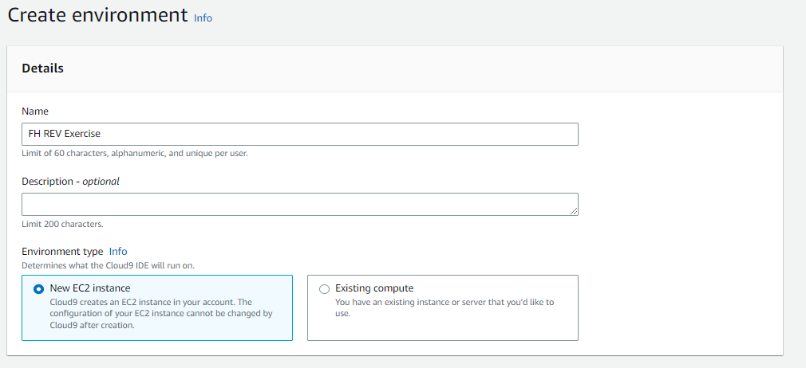
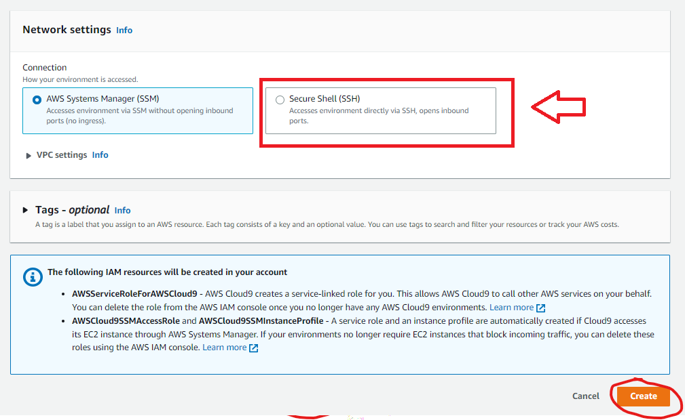

# Lecture 01: Setup a Webserver with Terraform and AWS

## Preperation

* Login to AWS Academy

Login URL: https://awsacademy.instructure.com/


Click on Student Login

* Enter Username


Email: Sxxxxxxxxxx@students.fh-hagenberg.at

Password: You have defined the password during the activation process of the account. It's not the FH SSO password!

* AWS Academy Console


* Open the "AWS Academy Learner Lab and navigate to the "Learner Lab" Module


* Click on "Start Lab"


* Click on "AWS Details" and "Download URL"


* Open downloaded text file and open the link in a new tab


* Navigate to the Cloud9 IDE


* Create a new Cloud9 Environment


* Add a proper Name



* Change Network Settings to "SSH" and click "Create"



* Click on "Open" and wait, until the Cloud9 IDE is ready


* Install Terraform in the Cloud9 Environment


Execute commands on the integrated terminal
```
wget https://releases.hashicorp.com/terraform/1.3.7/terraform_1.3.7_linux_amd64.zip
unzip terraform_1.3.7_linux_amd64.zip
sudo mv terraform /usr/local/bin
terraform --version
```


* Ready for the Exercise


## Exercise Part 01: Setup Webserver instance

The goal of this exercise part is to setup a new EC2 instance and install a webserver on the instance. For the installation of the webserver, the "user data" (https://docs.aws.amazon.com/AWSEC2/latest/UserGuide/user-data.html) feature is used. The webserver need also a firewall to secure the server. AWS provides the concept of a security group, which allows to define which port is allowed (open) for ingress and egress.

### Steps
* Create "main.tf" file in Cloud9
* Add AWS provider

Terraform Doc: https://developer.hashicorp.com/terraform/language/providers

```
###########################################
# provider
###########################################

provider "aws" {
  region = "us-east-1"
}
```

* Initilialize Terraform workspace

Execute command in terminal
```
terraform init
```


* Define local variables for the machine image and instance type

Terraform Doc: https://developer.hashicorp.com/terraform/language/values/locals

```
###########################################
# locals
###########################################

locals {
  webserver_ami           = "ami-0b5eea76982371e91"
  webserver_instance_type = "t2.micro"
}
```


* Define security group for the webserver

Define a virutal firewall (Security Group) which allows the ingest port 80 for everyone (0.0.0.0/0) and a egress rule for all ports (-1) and all targets (0.0.0.0/0).

Doc: https://docs.aws.amazon.com/AWSEC2/latest/UserGuide/ec2-security-groups.html

Terraform Doc: https://registry.terraform.io/providers/hashicorp/aws/latest/docs/resources/security_group
```
###########################################
# resources
###########################################

resource "aws_security_group" "webserer_sg" {
  name = "webserver-sg"

  ingress {
    from_port   = 80
    to_port     = 80
    protocol    = "tcp"
    cidr_blocks = ["0.0.0.0/0"]
  }

  egress {
    from_port   = 0
    to_port     = 0
    protocol    = "-1"
    cidr_blocks = ["0.0.0.0/0"]
  }
}
```

* Define webserver instance with install script

The instance resource defines the machine image (AMI) and instance type. The machine image is a hard drive with a preinstalled operating system. In this case, it is a AWS Linux 2 instance. The instance type describes the size of the instance. It combines the CPU architecture, CPU count and amount of memory. Also other special instance feature can be included like GPU accelerator.

Doc: https://docs.aws.amazon.com/AWSEC2/latest/UserGuide/Instances.html

Terraform Doc: https://registry.terraform.io/providers/hashicorp/aws/latest/docs/resources/instance

```
resource "aws_instance" "webserver_instance" {
  ami                    = local.webserver_ami
  instance_type          = local.webserver_instance_type
  vpc_security_group_ids = ["${aws_security_group.webserer_sg.id}"]

  user_data = <<-EOF
            #!/bin/bash
            sudo yum update -y
            sudo yum install -y httpd
            sudo systemctl start httpd
            sudo systemctl enable httpd
            usermod -a -G apache ec2-user
            echo "<html><body><h1>Hello World from $(hostname -f)</h1></body></html>" > /var/www/html/index.html
          EOF

  tags = {
    Name = "webserver"
  }
}
```

* Define output variables

Doc: https://developer.hashicorp.com/terraform/language/values/outputs

```
###########################################
# output 
###########################################

output "public_ip" {
  value = aws_instance.webserver_instance.public_ip
}

output "url" {
  value = "http://${aws_instance.webserver_instance.public_ip}"
}
```

## Exercise Part 02: Add SSH Access to the ec2 instance

The goal of this exercise part is to allow SSH access to the ec2 instance. SSH will be useful for troubleshooting on the instance or do manual changes. 

### Steps
* Add Terraform providers local and tls for creating certificates and store the private key to a local file
* Create a resource to create a new certificate
* Define a resource to store the private key part of the certificate to a local file
* Create an AWS key pair resource
* Open the port 22 for SSH access on the security group
* Add the AWS key pair to the ec2 instance
* Define a output variable with the full ssh command to access the instance

Example: *sudo ssh ec2-user@192.168.0.1 -i privateKey.prem*


## Exercise Part 03: Download the static resources for the webserver from a S3 bucket

The goal of this part of the exercise is to download the website (static resources) from an S3 bucket. The S3 bucket should contain at least the index.html file. The S3 bucket should also be created with a Terraform resource. The file upload to the S3 bucket can be done manually or via Terraform. The website should only be downloaded once via the web server setup (user data script). On AWS Linux 2, the AWS CLI is already installed, which can be used to download the static resources from the S3 bucket. Before the instance can access the S3 bucket, an instance profile must be assigned to the ec2 instance. The instance profile automatically provides AWS credentials to the instance. In AWS Academy, it is not possible to create a new IAM role and instance profile. For this reason, the existing instance profile *arn:aws:iam::<aws-account-id>:instance-profile/LabInstanceProfile* should be used.
