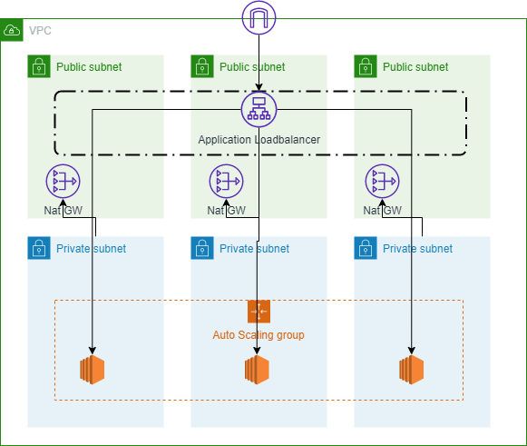

# Lecture 02: Setup a high available and secure Webserver with Terraform

## Introduction



## Exercise Part 01: Setup custom network infrastructure

The high availability and secure setup requires a special network setup. The network need provide three public and private networks for the web server intances and the load balancers. The private networks also allows to secure the web server instances, that no direct public access is possible.

### Steps

* Add Providers with default

```
###########################################
# provider
###########################################

provider "aws" {
  region = "us-east-1"

  default_tags {
    tags = {
      project = "REV01: Exercise 02"
    }
  }

}
```

* Define locals for the network setup
```
###########################################
# locals
###########################################

locals {

  name = "ACME"

  # network settings
  network_cidr = "172.16.0.0/21"

  public_subnets  = ["172.16.0.0/24", "172.16.1.0/24", "172.16.2.0/24"]
  private_subnets = ["172.16.4.0/24", "172.16.5.0/24", "172.16.6.0/24"]

  # TODO webserver & scaling settings
  
}
```

* Add data section
```
###########################################
# data
###########################################

data "aws_availability_zones" "available" {
  state = "available"
}
```

* Use predefined aws network module
```
###########################################
# resources: network
###########################################

# https://www.arin.net/reference/research/statistics/address_filters/
# https://jodies.de/ipcalc?host=172.16.0.0&mask1=21&mask2=24

module "vpc" {
  source  = "terraform-aws-modules/vpc/aws"
  version = "2.77.0"

  name = "${local.name} Network"
  cidr = local.network_cidr

  azs                  = data.aws_availability_zones.available.names
  public_subnets       = local.public_subnets
  private_subnets      = local.private_subnets
  enable_dns_hostnames = true
  enable_dns_support   = true

  enable_nat_gateway = true
  single_nat_gateway = true
}
```

## Exercise Part 02: Setup Auto Scaling Group for the webserver

Create an Auto Scaling Group (ASG) for the webserver instance cluster. The ASG takes care, that enough instances are running and also handles the instance life cycle.

### Steps

* Add locals for the webserver setup
```
  # webserver settings
  webserver_ami           = "ami-0b5eea76982371e91"
  webserver_instance_type = "t2.micro"

  # scaling
  scale_min_size     = 1
  scale_max_size     = 6
  scale_desired_size = 3
```

* Define Security Groups for Loadbalancer and EC2 instnaces
```
###########################################
# resources: loadbalancer + auto scaling group
###########################################


resource "aws_security_group" "webserer_sg_alb" {
  name   = "${local.name} Webserver ALB SG"
  vpc_id = module.vpc.vpc_id

  ingress {
    from_port   = 80
    to_port     = 80
    protocol    = "tcp"
    cidr_blocks = ["0.0.0.0/0"]
  }

  egress {
    from_port   = 0
    to_port     = 0
    protocol    = "-1"
    cidr_blocks = ["0.0.0.0/0"]
  }
}


resource "aws_security_group" "webserer_sg_ec2" {
  name   = "${local.name} Webserver EC2 SG"
  vpc_id = module.vpc.vpc_id

  ingress {
    from_port       = 80
    to_port         = 80
    protocol        = "tcp"
    security_groups = [aws_security_group.webserer_sg_alb.id]
  }

  egress {
    from_port   = 0
    to_port     = 0
    protocol    = "-1"
    cidr_blocks = ["0.0.0.0/0"]
  }
}
```

* Create installation file for web server


File: user-data.sh
```
#!/bin/bash
sudo yum update -y
sudo yum install -y httpd
sudo systemctl start httpd
sudo systemctl enable httpd
usermod -a -G apache ec2-user
echo "<html><body><h1>Hello World from $(hostname -f)</h1></body></html>" > /var/www/html/index.html
```


* Add Auto Scaling Group for handling the webserver instance lifecylce
```
resource "aws_launch_configuration" "webserver_launch_config" {
  name_prefix     = "websever-launch-config"
  image_id        = local.webserver_ami
  instance_type   = local.webserver_instance_type
  user_data       = file("user-data.sh")
  security_groups = [aws_security_group.webserer_sg_ec2.id]

  lifecycle {
    create_before_destroy = true
  }
}

resource "aws_autoscaling_group" "webserver_asg" {
  name                 = "${local.name} webserver-asg"
  min_size             = local.scale_min_size
  max_size             = local.scale_max_size
  desired_capacity     = local.scale_desired_size
  launch_configuration = aws_launch_configuration.webserver_launch_config.name
  vpc_zone_identifier  = module.vpc.private_subnets

  tag {
    key                 = "Name"
    value               = "${local.name} webserver"
    propagate_at_launch = true
  }
}
```

* Add Application Loadbalancer for all weberver instances
```
resource "aws_lb_target_group" "webserver_target_group" {
  name                 = "${local.name}-webserver-tg"
  port                 = 80
  protocol             = "HTTP"
  vpc_id               = module.vpc.vpc_id
  deregistration_delay = 5
}

resource "aws_lb" "webserver_alb" {
  name               = "${local.name}-webserver-alb"
  internal           = false
  load_balancer_type = "application"
  security_groups    = [aws_security_group.webserer_sg_alb.id]
  subnets            = module.vpc.public_subnets
}

resource "aws_lb_listener" "webserver_alb_listener" {
  load_balancer_arn = aws_lb.webserver_alb.arn
  port              = "80"
  protocol          = "HTTP"

  default_action {
    type             = "forward"
    target_group_arn = aws_lb_target_group.webserver_target_group.arn
  }
}

resource "aws_autoscaling_attachment" "webserver_asg_attachment" {
  autoscaling_group_name = aws_autoscaling_group.webserver_asg.id
  lb_target_group_arn    = aws_lb_target_group.webserver_target_group.arn
}
```

* Add output section for showing the URL of the webserver cluster
```
###########################################
# output 
###########################################

output "url" {
  value = "http://${aws_lb.webserver_alb.dns_name}"
}
```

## Exercise Part 03: Enable Stickiness Policy

Some web application requires, that all requests from one user need to go to the same web server. For that reason, we need to enalbe the stickiness policy on the loadbalancer.

### Steps

* Add a stickiness configuration to the target group of the load balancer
* Check with the browser developer tools, that the load balancer cookie is set
* Refresh the page server times to verify, that you always lands on the same server

## Exercise Part 04: Add a bastion host to allow SSH access to the webserver

The webserver instances are running into private subnets. That results into a problem, that we can't access the webserver instances directly to open a SSH connection. The solution for this problem is to setup a bastion host in the public subnet. That allows to connection with SSH to the bastion host and create then another SSH connection from this instance to one of the web server. Important: Define the Security Groups of the web server, that only the bastion host is allowed to open an SSH connectoin.
